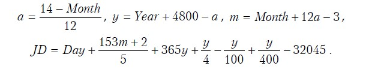
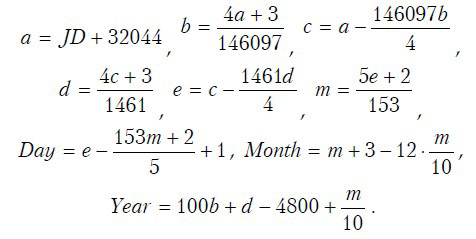
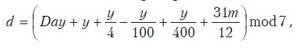
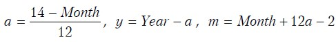

# День недели

Напишите программу, которая по дате определяет день недели, на который эта дата приходится, и очередной год, в который заданное число будет приходиться на пятницу. 

В помощь: [Юлианская дата](https://ru.wikipedia.org/wiki/Юлианская_дата)

## Вход
Пользователь вводит строку в формате `dd.mm.yyyy`

## Выход
Если введены неверные данные, то вывести сообщение об ошибке: `Unknown` 

Если строка в заданном формате, в первой строке вывести название дня недели: `Monday`, `Tuesday`, `Wednesday`, `Thursday`, `Friday`, `Saturday`, `Sunday`. 
Во второй строке вывести очередной год, в который заданное число будет приходиться на пятницу.

# Приложение: Перевод даты григорианского календаря в юлианскую дату

Здесь *Year* – номер года, *Month* – месяца, *Day* – дня в григорианском календаре, *JD* – номер юлианского дня, который начинается в полдень числа, для которого производятся вычисления.
Все деления – целочисленные.

Для обратного перевода (т.е. чтобы перевести юлианскую дату в день, месяц и год) можно использовать эти формулы:

## Приложение: Вычисление дня недели для григорианского календаря:

 

где *Year* – номер года, *Month* – месяца, *Day* – дня. 
Все деления – целочисленные. Вычисленное по формуле значение определяет день недели: 0 – воскресение, 1 – понедельник, ... 6 – суббота.

